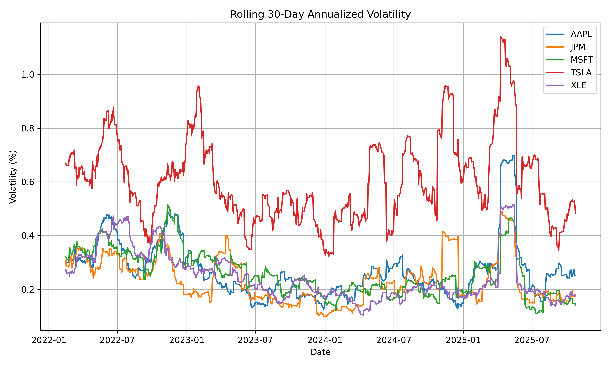
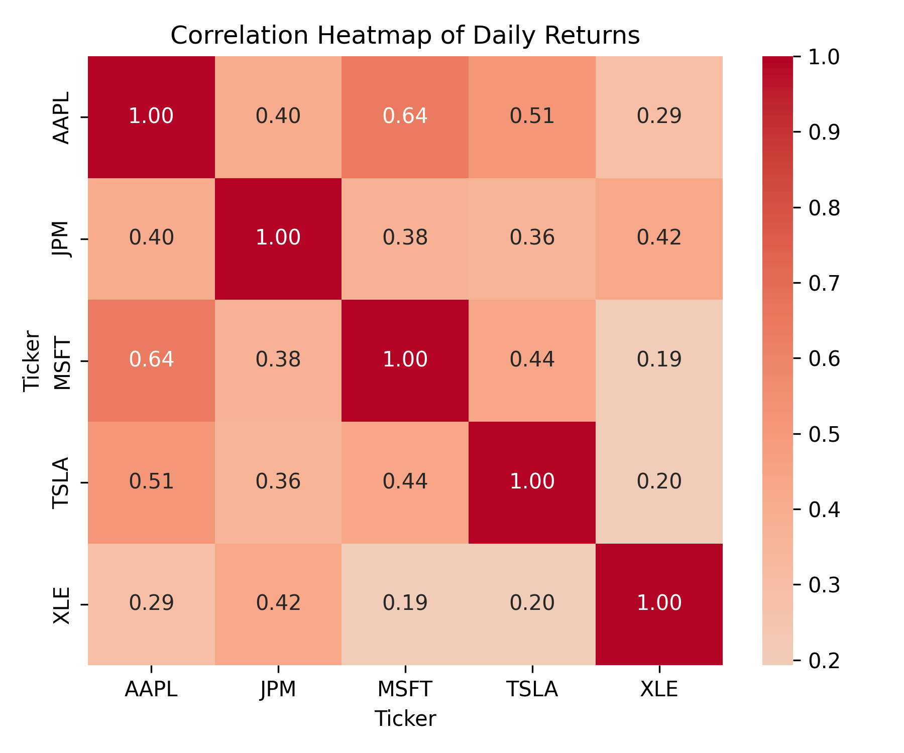

# 📈 Quantitative Analysis of Risk & Return (2022–2025)

## 🧭 Project Overview
This project explores **risk vs return dynamics** across major U.S. sectors — technology, finance, and energy — using historical market data from 2022–2025.  
The goal is to visualize and quantify how volatility, returns, and correlations influence portfolio construction decisions.

---

## ⚙️ Tech Stack
- **Language:** Python 3  
- **Libraries:** pandas, numpy, yfinance, matplotlib, seaborn, jupyter  
- **Data Source:** Yahoo Finance (via yfinance API)

---

## 📊 Dataset
| Ticker | Company / ETF | Sector |
|:-------|:---------------|:--------|
| AAPL | Apple Inc. | Technology |
| MSFT | Microsoft Corp. | Technology |
| TSLA | Tesla Inc. | Consumer Discretionary |
| JPM | JPMorgan Chase & Co. | Financials |
| XLE | Energy Select Sector SPDR Fund | Energy |

---

## 📈 Rolling Volatility Analysis

- **TSLA** shows the highest volatility, reflecting aggressive growth dynamics.  
- **AAPL / MSFT** remain moderate and stable.  
- **JPM / XLE** exhibit defensive, low-volatility behavior.  
> *Volatility = Risk, but not necessarily = Loss.*

---

## 🔗 Correlation Heatmap

- **AAPL–MSFT** = 0.64 → strong correlation within tech.  
- **JPM / XLE** show weak correlation with tech → better diversification.  
- **TSLA** ≈ 0.4 correlation → partial market independence.

---

## 📋 Quantitative Summary

| Asset | Annualized Return (%) | Annualized Volatility (%) | Key Insight |
|:------|:----------------------:|:--------------------------:|:-------------|
| **AAPL** | 14.40 | 29.05 | Steady large-cap growth |
| **MSFT** | 16.26 | 27.04 | Strong performer, moderate risk |
| **TSLA** | 21.56 | 62.51 | High-risk, high-reward growth |
| **JPM** | 22.24 | 25.07 | Strong returns with lower volatility |
| **XLE** | 18.39 | 26.25 | Consistent and defensive |

---

## 🧠 Insights
Diversification across sectors (Tech, Finance, Energy) delivers a **balanced portfolio** with high return potential and controlled volatility.  
> “Risk is not inherently bad; unmanaged risk is.”

---

## 🧩 Next Steps
- Add **Sharpe ratio & beta analysis**
- Expand to **10-asset portfolio optimization**
- Deploy via **Streamlit dashboard**

